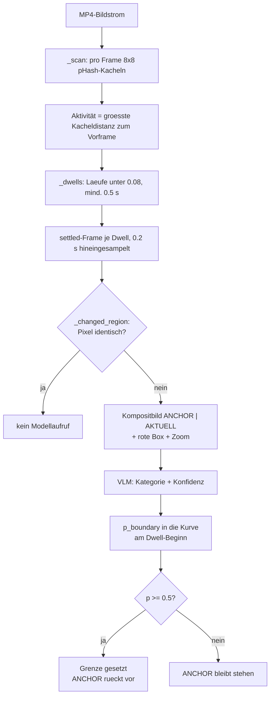
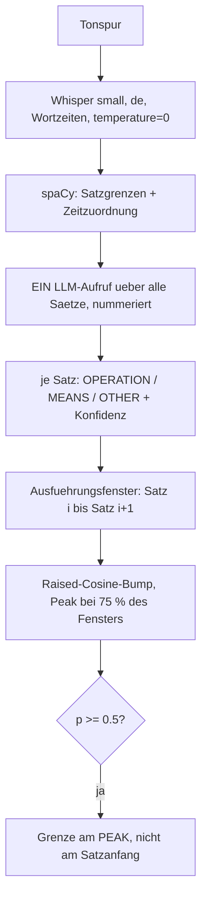

# Segmentierung der Signalmodalitäten: Video und Audio

Wie aus **einer** Aufzeichnung die Handlungsgrenzen der beiden Signalmodalitäten
bestimmt werden. Code: `src/docupilot/segmentation/`.

Der Ereignisstrom (`events.py`) bleibt hier außen vor — er ist kein Signal,
sondern eine Folge einzelner Zeitpunkte, und wird gesondert behandelt. Ein
Überblick über alle drei Modalitäten steht in
[grenzkandidaten.md](grenzkandidaten.md).

---

## 1. Das gemeinsame Muster

Beide Modalitäten sind **zweistufig** gebaut, und zwar aus demselben Grund: Die
Handlungsgrenze ist keine Signalgröße. Ob eine Änderung auf dem Bildschirm eine
abgeschlossene Handlung ist oder nur ein geöffnetes Menü, lässt sich an keiner
Pixelmenge ablesen; ob ein Satz einen Arbeitsschritt ankündigt oder nur einen Weg
dorthin, an keinem akustischen Merkmal.

| Stufe | Aufgabe | Video | Audio |
|---|---|---|---|
| **1. Strukturell** | *Wo* könnte eine Grenze sein? | pHash-Aktivität → Ruhezustände | Whisper + spaCy → Sätze |
| **2. Semantisch** | Ist es *dort* eine Grenze? | VLM beurteilt Zustandspaar | LLM beurteilt jeden Satz |

Die Arbeitsteilung ist bewusst asymmetrisch: **Die erste Stufe verantwortet den
Recall, die zweite die Präzision.** Was Stufe 1 nicht vorschlägt, sieht das
Modell nie — dieser Verlust ist unwiederbringlich. Deshalb sind die
Strukturparameter auf Vollständigkeit ausgelegt und die Aussortierung dem Modell
überlassen.

### Der gemeinsame Vertrag: `BoundaryEvidence`

Beide liefern dasselbe Objekt (`evidence.py`):

| Feld | Typ | Bedeutung |
|---|---|---|
| `times_s` | `float64[T]` | Zeitstempel je Abtastpunkt |
| `score` | `float32[T]` | **abgestufte** Evidenz in `[0, 1]` |
| `boundaries_s` | `list[float]` | Grenzen, auf die sich die Modalität festlegt |

Entscheidend ist das Wort *abgestuft*. Die Modalität gibt eine **Kurve** aus,
keine Entscheidung. `boundaries_s` (Schwelle `BOUNDARY_THRESHOLD = 0.5`) ist nur
die Selbstauskunft der Modalität für die Anzeige — die nachgelagerte Fusion
benutzt sie **nicht**, sondern die lokalen Maxima von `score`. Andernfalls könnte
die Fusion Grenzen nur noch entfernen und nie hinzufügen, und ihr Recall wäre
durch die Schwelle jeder einzelnen Modalität gedeckelt.

### Zwei Zeitachsen

| | Raster | Herkunft |
|---|---|---|
| **Video** | eigene Framezeiten, variabel | `ffprobe`-`pts_time` aus dem MP4, auf den ersten Frame genullt |
| **Audio** | 50 Hz (`GRID_HZ`), äquidistant | `grid(duration_s)` über der dekodierten Tonspurlänge |

Video benutzt die echten Framezeiten, weil der Recorder mit ffmpegs Wanduhr
stempelt (VFR) — eine angenommene Bildrate würde über eine Aufnahme hinweg
driften. Audio hat keine natürlichen Abtastpunkte für Grenzen und bekommt
deshalb ein festes Raster; 50 Hz (20 ms) liegt weit unter jeder Toleranz τ und
bestimmt damit nur die Quantisierung einer gemeldeten Grenze.

### Zwei Zeichen-Primitive

Beide Modalitäten tragen ihre Evidenz mit einer von zwei Funktionen in die Kurve
ein. Bei Überlappung gewinnt jeweils der höhere Wert (`np.maximum`) — Evidenz
wird nicht addiert, sonst würden dicht beieinanderliegende Urteile eine Grenze
erzeugen, die keines von ihnen behauptet.

- **`apply_gaussian(score, center, value, spread)`** — symmetrischer Peak um
  `center`, σ = `spread/2`, abgeschnitten bei ±`spread`. Für Video: Der Zeitpunkt
  ist bekannt, die Unsicherheit ist symmetrisch.
- **`apply_window(score, lo, hi, peak, value)`** — Raised-Cosine-Bump über
  `[lo, hi]`, Null an beiden Rändern, `value` am `peak`, bei außermittigem Peak
  asymmetrisch. Für Audio: Der Zeitpunkt ist **nicht** bekannt, nur das Intervall.

---

## 2. Video (`video.py`)

Liest ausschließlich den Bildstrom. Weder Tonspur noch `events.json` werden
geöffnet — diese Unabhängigkeit ist die Voraussetzung der Shapley-Analyse.



### 2.1 Aktivitätssignal — wo steht der Bildschirm still?

Jedes Frame wird in Graustufen gewandelt und in ein **8×8-Kachelraster**
zerlegt; für jede der 64 Kacheln wird ein perzeptueller Hash (`imagehash.phash`,
`hash_size=8`) berechnet. Die **Frame-Aktivität** ist die *größte* Kacheldistanz
zum Vorframe, normiert auf `[0, 1]`:

```python
activity[i] = max(hamming(kachel_j(i-1), kachel_j(i)) for j in 0..63) / 64
```

Zwei Entwurfsentscheidungen stecken darin:

- **Kacheln statt Gesamtbild.** Eine bedeutsame Änderung betrifft oft nur einen
  kleinen Ausschnitt (eine Zelle wird umgefärbt, ein Pfeil erscheint im
  Tabellenkopf). Über das ganze Bild gemittelt verschwindet sie im Rauschen.
- **Maximum statt Mittelwert über die Kacheln.** Dieselbe Logik: Eine Kachel, die
  sich stark ändert, soll das Frame als „aktiv" markieren, auch wenn 63 andere
  ruhig sind.

Der perzeptuelle Hash bildet die niederfrequenten DCT-Koeffizienten einer Kachel
auf 64 Bit ab und ist damit gegenüber Kompressionsartefakten stabil — im
Gegensatz zu einem Pixelvergleich, der auf jedem Codec-Rauschen anschlägt.

### 2.2 Dwells — eingerastete Zustände

Ein **Dwell** ist ein zusammenhängender Lauf von Frames mit
`activity < _ACTIVITY_QUIET` (0.08), der mindestens `_MIN_DWELL_S` (0.5 s)
dauert. Die Blickrichtung ist umgekehrt zum üblichen Vorgehen: Gesucht wird nicht
die Änderung, sondern die **Ruhe**. Für Bildschirmaufzeichnungen ist das die
robustere Größe — die Oberfläche steht zwischen zwei Bedienschritten
buchstäblich still, während der Übergang selbst aus Animationen, Zwischenframes
und Neuzeichnungen besteht.

Die Mindestdauer ist die erste Gegenmaßnahme gegen Über-Segmentierung: Sie
verwirft Ruhephasen, die zu kurz sind, um ein abgeschlossener Zustand zu sein.

Je Dwell wird **ein** Frame ausgewählt, `_SETTLE_OFFSET_S` (0.2 s) hinter dessen
Beginn — das erste ruhige Frame kann noch eine ausklingende Animation zeigen.
Die so gewählten Frames werden in **einem** linearen Dekodierdurchlauf gelesen
und dabei auf 896 px Breite verkleinert (sequenzielles Dekodieren schlägt Seeken
in einem Long-GOP-MP4, und volle Auflösung bräuchte niemand — das Modell sieht
ohnehin nur die verkleinerte Fassung).

### 2.3 Der Anchor — Vergleich gegen den zuletzt etablierten Zustand

Der Kern der Videomodalität. Verglichen wird **nicht** Dwell *i* gegen Dwell
*i−1*, sondern jeder Dwell gegen einen **Anchor**, der den zuletzt *akzeptierten*
Zustand hält. Der erste Dwell wird zum Anchor; danach gilt:

> Der Anchor rückt **nur** vor, wenn eine Grenze akzeptiert wurde. Grenze setzen
> und Anchor vorrücken sind **eine** Entscheidung.

Das macht die Folge der Urteile voneinander abhängig statt lokal. Konkret: Öffnet
jemand ein Menü (Dwell A → B), navigiert in ein Untermenü (B → C) und klickt dann
den Punkt, der etwas ändert (C → D), so wird D nicht gegen C beurteilt — sondern
gegen A, den letzten Zustand, der tatsächlich etwas bedeutete. Die
Zwischenzustände B und C werden als `TRANSIENT_UI` abgelehnt, der Anchor bleibt
auf A stehen, und die Frage an das Modell lautet am Ende: „Ist zwischen dem
Ausgangszustand und jetzt eine Handlung abgeschlossen worden?" Das ist die
Frage, auf die es ankommt.

**Änderungsregion.** Vor dem Modellaufruf wird bestimmt, welche Kacheln sich
zwischen Anchor und aktuellem Frame **im Pixelwert** unterscheiden (mittlere
Graudifferenz > `_PIXEL_CHANGE_EPS` = 1.0); daraus wird eine Bounding Box gebildet.
Pixel und nicht pHash, weil auf einer texturarmen Kachel der Hash schon bei
Codec-Rauschen kippt. Ergibt sich **keine** Region, sind die beiden Zustände
pixelgleich — es gibt nichts zu beurteilen und kein Modellaufruf wird bezahlt.

### 2.4 Das VLM-Urteil (`video_scoring.py`)

Anchor und aktuelles Frame werden zu **einem** Bild zusammengesetzt: links
BEFORE, rechts AFTER, mit Beschriftungsbannern, als JPEG (Qualität 80).

Dass es *ein* Bild ist und nicht zwei, ist keine Kosmetik: Als zwei getrennte
Bilder übergeben, vertauscht das Modell sie gelegentlich — bei einer
Vorher-Nachher-Frage ist das fatal. Die räumliche Anordnung im selben Bild macht
die Reihenfolge eindeutig.

Auf beide Hälften wird die Änderungsregion als **rote Box** gezeichnet
(Set-of-Mark). Deckt die Box weniger als 35 % der Fläche ab, wird zusätzlich eine
zweite Zeile mit dem vergrößerten Ausschnitt angehängt — bei einer großflächigen
Änderung wäre der Ausschnitt wieder das ganze Bild und damit reiner Token-Aufwand.

Der Systemprompt zwingt zu einer festen Reihenfolge: **erst beobachten, dann
klassifizieren**. Das Feld `observation` wird vor `category` gefüllt, damit die
Kategorie aus dem Beobachteten folgt und nicht umgekehrt.

Fünf Kategorien:

| Kategorie | Bedeutung |
|---|---|
| `ACTION_COMPLETED` | **Grenze.** Das fertige *Ergebnis* einer Benutzeroperation ist sichtbar und bleibt bestehen — Inhalt/Struktur geändert, bewusst gewählte Ansicht, oder das verzögerte Ergebnis einer angestoßenen Operation |
| `TRANSIENT_UI` | Overlay oder Zwischenschritt, den man nur durchläuft: Menü, Dropdown, Dialog, Auswahl, Scrollen, Wechsel dorthin, wo man gleich handelt |
| `IN_PROGRESS` | Dieselbe Operation läuft noch: halb getippt, Spinner, halb gezeichnetes Frame |
| `NO_CHANGE` | Nichts, oder nur Caret/Uhr/Codec-Rauschen |
| `SYSTEM_INITIATED` | Vom System ausgelöst, nicht vom Benutzer — Benachrichtigung, Toast |

Die Leitfrage ist ausdrücklich **Ziel gegen Mittel**, nicht Pixelmenge: Ein sich
öffnendes Dropdown zeichnet weit mehr Bildschirm neu als ein angewendeter Filter
— trotzdem ist nur der Filter eine Handlung.

**Vom Urteil zur Evidenz:**

```
p_boundary = confidence            wenn category == ACTION_COMPLETED
             1 − confidence        sonst
```

Kategorie plus Konfidenz **sind** zusammen eine Wahrscheinlichkeit über die
Grenzfrage — genau das, was der Random Forest stromabwärts braucht. Die Modalität
gibt bewusst nie eine Entscheidung weiter.

Die Antwort ist per JSON-Schema erzwungen (Structured Outputs), `thinking` auf
`adaptive` bei niedrigem Effort. Eine Verweigerung (`stop_reason == "refusal"`)
gilt als „keine Evidenz für dieses Paar"; ein Abschneiden durch `max_tokens` wirft
dagegen laut — das wäre kein Einzelfallproblem, sondern ein falsch gesetztes
Budget, das jedes Paar träfe.

### 2.5 Eintrag in die Kurve

Das Urteil wird per `apply_gaussian` **am Beginn des Dwells** eingetragen
(σ = 0.5 s, Fenster ±1 s), nicht am beurteilten Frame: Der Dwell-Beginn ist der
Moment, in dem der Bildschirm einrastet — also der Zeitpunkt, den die Annotation
meint. Der 0.2 s hineingesampelte Frame ist nur das, was das Modell zu sehen
bekommt.

Bei `p_boundary ≥ 0.5` wird zusätzlich `times_s[dwell_start]` in `boundaries_s`
aufgenommen und der Anchor rückt vor.

Liefert das Modell eine unbrauchbare Antwort (`judgement is None`), bleibt dieses
Paar **ohne** Evidenz — es wird nicht geraten, und der Anchor bleibt stehen.

### 2.6 Kostenbremsen

| Bremse | Wirkung |
|---|---|
| Pixelgleiche Zustände | kein Modellaufruf |
| `_MAX_CALLS = 400` | Deckel gegen flackernde Aufnahmen; bei Erreichen **`warnings.warn`** mit Sessionnamen — ein stiller Deckel läse sich als „alles geprüft" |
| `gui_vlm_cache.json` | Verdikte, geschlüsselt über den **Inhalt** des Kompositbilds + Modell + `PROMPT_VERSION` |

Der inhaltsbasierte Cache-Schlüssel bedeutet: Neuencodieren des Videos oder
Umstellen der Vorschlagsstufe kostet nichts, solange dieselben zwei Frames
verglichen werden.

### 2.7 Parameter

| Parameter | Wert | Herkunft |
|---|---|---|
| `_PHASH_SIZE` | 8 | Standardgröße für pHash |
| `_ACTIVITY_GRID` | 8 (→ 64 Kacheln) | gesetzt |
| `ACTIVITY_QUIET` | 0.08 | auf der **Entwicklungssession session_30** gesweept — günstigste Einstellung bei vollem Recall; session_30 liegt außerhalb des Korpus (session_01–25) |
| `_MIN_DWELL_S` | 0.5 s | dito |
| `_SETTLE_OFFSET_S` | 0.2 s | gesetzt (ausklingende Animation) |
| `_PIXEL_CHANGE_EPS` | 1.0 | ungetunt — die Box muss nur zeigen, nicht entscheiden |
| `_SPREAD_S` | 1.0 s | = primäre Toleranz τ |
| `_MAX_CALLS` | 400 | Budgetdeckel |

---

## 3. Audio (`audio.py`)

Liest ausschließlich die Tonspur.



### 3.1 Der Grundgedanke: Audio kennt das Intervall, nie den Zeitpunkt

Das ist die zentrale Eigenschaft dieser Modalität. Die sprechende Person kündigt
Schritte **in Reihenfolge** an, führt sie aber *danach* aus. Schritt *i* ist also
irgendwann zwischen Ansage *i* und Ansage *i+1* abgeschlossen — der Zeitpunkt
selbst ist im Ton nicht enthalten.

Daraus folgt alles Weitere: Kein Peak am Satzanfang, sondern ein **Fenster**, und
die Grenze liegt in diesem Fenster. Und daraus folgt auch eine Erwartung an die
Auswertung: Audio allein kann bei enger Toleranz keinen hohen F1 erreichen. Das
ist ein Befund über die Modalität, kein Fehler in der Implementierung.

### 3.2 Transkript (Whisper)

Modell `small` — `base` verfehlte in Pilotaufnahmen deutschsprachiges
Anleitungsvokabular. Aufruf mit `language="de"`, `word_timestamps=True`,
`condition_on_previous_text=False`.

**`temperature=0.0` als Skalar, nicht als Whisper-Standardtupel.** Das Standard-
`(0.0, 0.2, …, 1.0)` ist eine Rückfallkette: Sieht ein Segment repetitiv oder
unsicher aus, wird es bei steigender Temperatur neu dekodiert — und jede
Temperatur über 0 **sampelt**. Zwei Läufe derselben Aufnahme lieferten dann
verschiedene Transkripte, verschiedene Sätze, einen anderen Cache-Schlüssel und
damit andere Evidenz; die Modalität wäre nicht reproduzierbar. Bei 0 ist der
Dekoder ein deterministisches Argmax.

Eine technische Nebenbedingung: `MultiHeadAttention.use_sdpa` wird prozessweit
abgeschaltet, weil die Wortzeitstempel aus den Cross-Attention-Gewichten gelesen
werden, die der fusionierte SDPA-Kernel nie zurückgibt. Whisper schaltet das
selbst um die Alignment-Phase herum ab — aber über ein **Klassenattribut**, also
prozessweit und nicht threadsicher. Zwei überlappende Läufe (Feature-Dialog und
Experiment-Fenster haben je einen Worker-Thread) würden sich gegenseitig
zurücksetzen.

### 3.3 Sätze (spaCy)

Der Satz ist die Einheit, in der beurteilt wird — er entspricht der Ansage eines
Arbeitsschritts. Zerlegt wird mit `de_core_news_lg` (Rückfall auf `md`, `sm`).

Die Zeitzuordnung geht über eine Zeichenposition→Zeit-Tabelle aus Whispers
Wortliste. Der Suchcursor rückt nach jedem Treffer weiter, damit ein wiederholtes
Wort auf sein eigenes Vorkommen abgebildet wird und nicht immer auf das erste.
Der Startzeitpunkt eines Satzes ist die Zeit des letzten Wortes, das bei oder vor
seiner Anfangsposition beginnt.

### 3.4 Das LLM-Urteil (`audio_scoring.py`)

**Ein einziger Aufruf für die gesamte Narration**, Sätze durchnummeriert
übergeben. Das ist notwendig, nicht sparsam: Ob ein Satz nur ein Mittel ist,
zeigt sich häufig erst am nächsten Satz („Ich gehe auf den Reiter Start." →
„… und mache den Text fett.") Satzweise Aufrufe könnten das nicht sehen.

Drei Kategorien:

| Kategorie | Bedeutung |
|---|---|
| `OPERATION` | **Grenze.** Kündigt eine Operation an, deren Abschluss einen bleibenden Zustand hinterlässt: angewendet, erstellt, eingegeben, gelöscht, verschoben, eingefügt, gespeichert, geöffnet — oder eine bewusst gewählte und beibehaltene Ansicht |
| `MEANS` | Nur ein Schritt *auf dem Weg*, ohne bleibendes Ergebnis: hinnavigieren, scrollen, markieren, kopieren, Menü oder Dialog öffnen, ins Feld klicken |
| `OTHER` | Kündigt keinen Schritt an: Füllwörter, lautes Denken, Kommentar zum Ergebnis, Vorlesen, Begrüßung |

Die Abbildung auf Evidenz ist dieselbe wie bei Video:
`p_boundary = confidence` bei `OPERATION`, sonst `1 − confidence`.

**`PROMPT_VERSION = "a2"` — die Beispielsätze wurden entfernt.** In `a1` stammten
sie aus einer Session, die anschließend bewertet wurde; die Verdikte hätten
nichts über Generalisierung ausgesagt. Der Prompt enthält jetzt nur noch die
Annotationsrichtlinie, auf Narration übertragen.

Einen Satz, zu dem das Modell kein Urteil liefert, füllt `parse()` mit
`OTHER / p = 0.0` auf — neutrale Evidenz statt einer Vermutung.

### 3.5 Ausführungsfenster und Bump

Jeder Satz öffnet ein Fenster bis zum **Beginn des nächsten Satzes**. Das letzte
Fenster wird geschlossen durch den **Median-Ansageabstand dieser Session** (bzw.
`_LAST_WINDOW_FALLBACK_S` = 8 s, wenn es nur einen Satz gibt), höchstens jedoch
am Aufnahmeende. Der Median ist sessioneigen — eine schnell sprechende Person
bekommt ein kürzeres letztes Fenster.

In dieses Fenster legt `apply_window` einen Raised-Cosine-Bump: null an beiden
Rändern, `p_boundary` am Peak. Der Peak sitzt bei `_COMPLETION_POSITION` = 0.75
der Fensterbreite — die Handlung wird eher gegen Ende des angekündigten
Abschnitts fertig als am Anfang.

Fällt der Peak durch das Aufnahmeende weg, gibt `apply_window` den **geklammerten**
Index zurück; die Grenze wird an diesem gemeldet.

Bei `p_boundary ≥ 0.5` wird die Grenze am **Peak** gesetzt, nicht am Satzanfang:
Der Abschluss liegt innerhalb des angekündigten Schritts, nicht bei der Ansage,
die ihn eröffnet.

Sätze, deren Fenster leer ist (`end ≤ start`, wenn spaCy innerhalb eines
Whisper-Wortes trennt), werden übersprungen.

### 3.6 Parameter

| Parameter | Wert | Herkunft |
|---|---|---|
| Whisper-Modell | `small` | `base` verfehlte deutsches Anleitungsvokabular (Pilot) |
| `temperature` | 0.0 | Reproduzierbarkeit, siehe 3.2 |
| spaCy-Modell | `de_core_news_lg` | Rückfall md/sm |
| `_COMPLETION_POSITION` | 0.75 | **provisorisch** — Richtung ist strukturell, der Bruchteil nicht (gemessener Median 0.77, n = 7). Auf einem Dev-Split kalibrieren, **nie** auf dem Auswertungsset |
| `_LAST_WINDOW_FALLBACK_S` | 8.0 s | nur bei einer einzigen Ansage relevant |
| `GRID_HZ` | 50 Hz | Quantisierung, weit unter jedem τ |

---

## 4. Gegenüberstellung

| | Video | Audio |
|---|---|---|
| Quelle | MP4-Bildstrom | Tonspur |
| Strukturelle Einheit | Dwell (Ruhezustand) | narrierter Satz |
| Zeitliche Schärfe | **hoch** — der Dwell-Beginn ist der Einrastmoment | **niedrig** — nur das Intervall ist bekannt |
| Modellaufrufe | einer je Zustandspaar (≤ 400) | **einer** je Aufnahme |
| Kontext des Urteils | Anchor = letzter etablierter Zustand | die gesamte Satzfolge |
| Eintragung | Gauß am Dwell-Beginn | Raised Cosine über dem Fenster, Peak bei 75 % |
| Grenze gemeldet bei | Dwell-Beginn | Fenster-Peak |
| Zustandsbehaftet? | **ja** — der Anchor rückt nur bei Annahme vor | nein — alle Sätze in einem Durchgang |

Die beiden sind komplementär gebaut, und das ist der Grund, warum sich ihre
Kombination überhaupt lohnen kann: Video weiß **wann**, aber muss jedes Paar
einzeln erfragen; Audio weiß **was** aus dem Zusammenhang der ganzen Erzählung,
kann den Zeitpunkt aber nur eingrenzen.

---

## 5. Was danach passiert

Beide Kurven gehen unverändert in die Fusion (`evaluation/fusion.py`):

1. **Kandidaten** = lokale Maxima der Score-Kurven (`scipy.signal.find_peaks`),
   *nicht* `boundaries_s` — siehe Abschnitt 1. Ob eine Koalition nur eigene
   Kandidaten sieht (isoliert) oder die Vereinigung aller (fixiert), ist ein
   Faktor des Experiments.
2. **Merkmale** = je Modalität fünf Spalten nach demselben Rezept: Punktwert,
   Maximum im Fenster ±0,5 / ±1 / ±2 s, Sessionrang. Die Fenster überbrücken den
   **semantischen** Versatz zwischen den Modalitäten (Audio zeigt auf ein
   Intervall, Video auf den Einrastmoment), nicht eine Uhren-Desynchronisation —
   die ist getrennt gemessen und liegt bei einigen zehn Millisekunden
   (`evaluation/synchronization.py`).
3. Random Forest, Leave-one-session-out, Schwelle je Fold auf Out-of-Bag-
   Vorhersagen kalibriert, Non-Maximum-Suppression mit Radius 1 s.

Details in [modalitaetsbeitraege.md](modalitaetsbeitraege.md).

---

## 6. Reproduzierbarkeit und Caching

Drei Ebenen, alle im Session-Verzeichnis:

| Datei | Inhalt | Schlüssel |
|---|---|---|
| `gui_vlm_cache.json` | VLM-Verdikte | Inhalt des Kompositbilds + Modell + `PROMPT_VERSION` |
| `audio_llm_cache.json` | LLM-Verdikte | Inhalt aller Sätze + Modell + `PROMPT_VERSION` |
| `<modalität>_evidence.npz` | die fertige `BoundaryEvidence` | Inhalt von `recording.mp4` und `events.json` + Quelltext der beteiligten Module + deren Konstanten zur Laufzeit |
| `video_activity.npz` | der pHash-Aktivitätsscan (Aktivität je Frame, Framezeiten, fps) | Inhalt von `recording.mp4` + Rastergröße; wird auch von der Synchronisationsmessung gelesen, damit das Video nicht zweimal dekodiert wird |

Die dritte Ebene (`store.py`) macht ein erneutes Öffnen des Feature-Dialogs oder
einen erneuten Korpuslauf praktisch kostenlos: gemessen 123 s → 0.1 s je Session,
bei bitgleichem Ergebnis. Ein abgebrochener Lauf wird **nicht** gespeichert — eine
abgeschnittene Kurve wäre beim Zurücklesen nicht von einer fertigen zu
unterscheiden.

Beide Modellstufen sind so gebaut, dass ein Lauf denselben Input auf denselben
Output abbildet: Whisper deterministisch bei Temperatur 0, die Verdikte über
Inhalts-Hashes gecacht, `PROMPT_VERSION` als expliziter Invalidierungsschalter.

---

*Entwicklungssession:* Die Strukturparameter wurden auf `session_30` bestimmt
(`video.py`, Kommentar zu `ACTIVITY_QUIET`), die nicht zum Korpus
(session_01–25) gehört. Eine Ausschlusslogik im Code ist deshalb nicht nötig;
welche Korpus-Sessions bei der Prompt-Entwicklung angesehen wurden, ist in
der Arbeit offenzulegen.
